# Table of Contents

---

## Step 1 - NextJS Intro, Pre-requisites

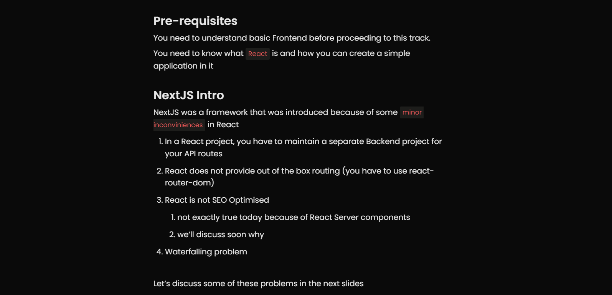

## Step 2 - SEO Optimisation

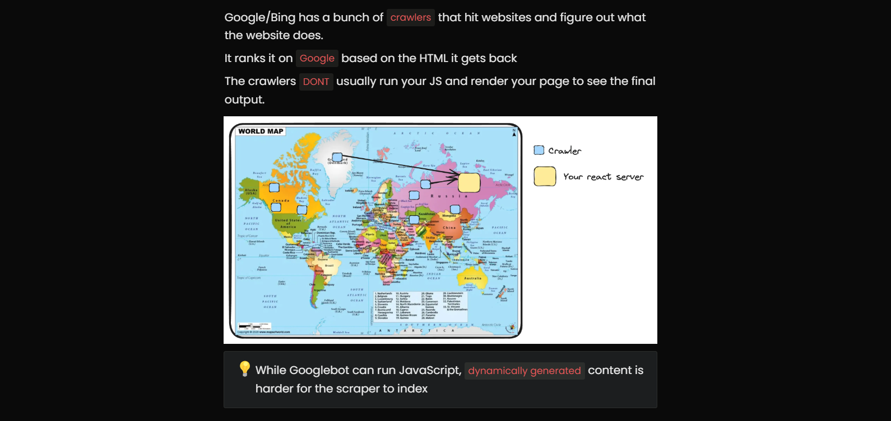
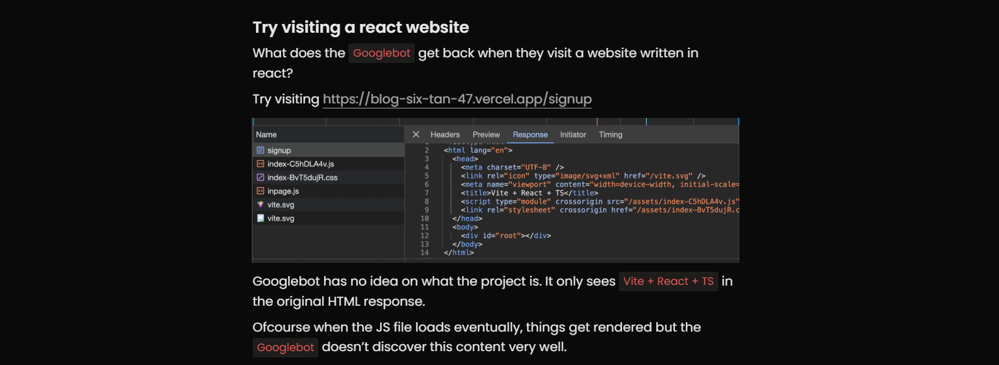

## Step 3 - Waterfalling problem

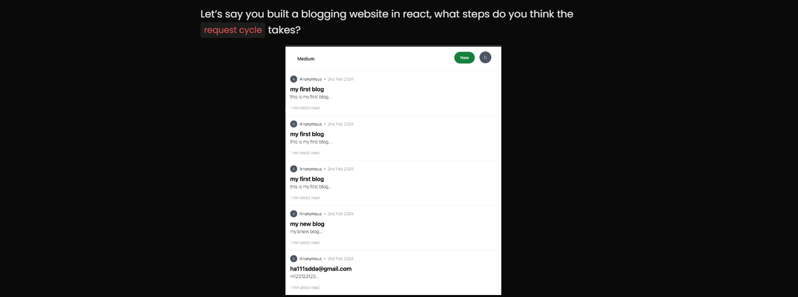
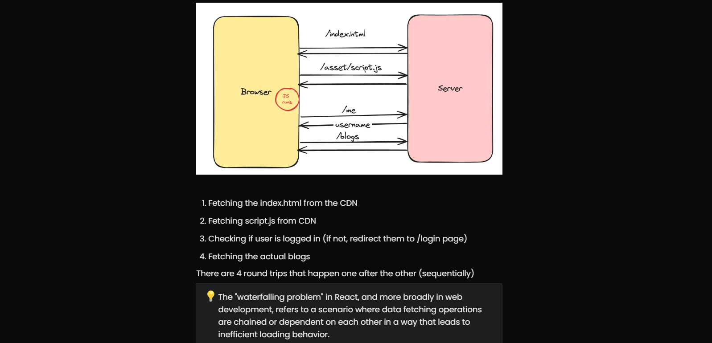


## Step 4 - Next.js offering

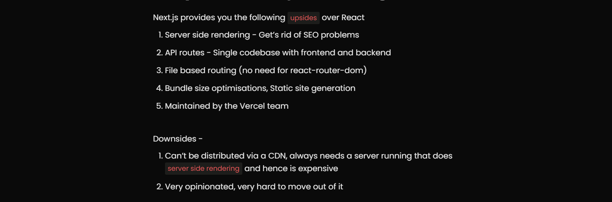

## Step 5 - Let’s bootstrap a simple Next app

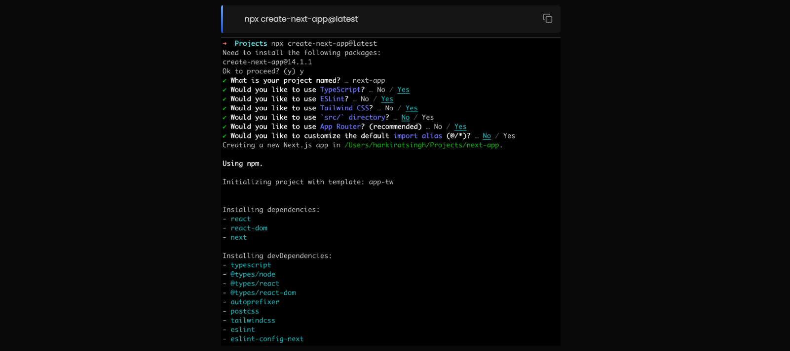
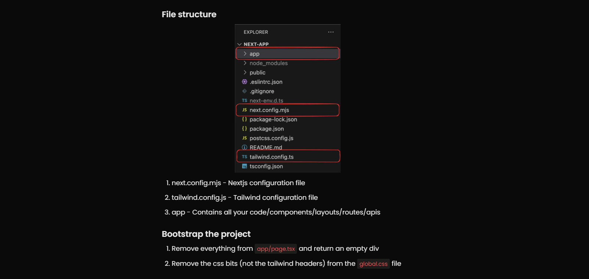

## Step 6 - Understanding routing in Next

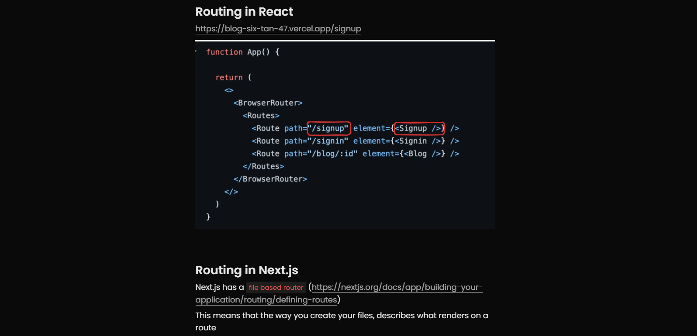
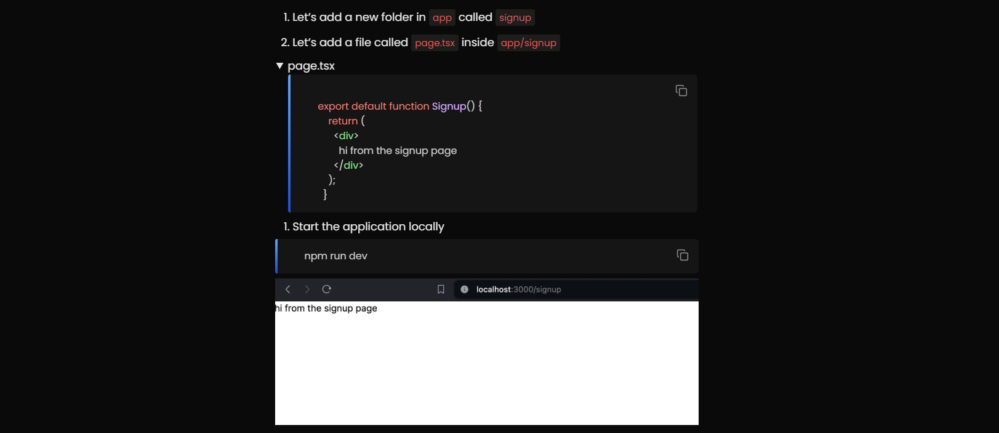
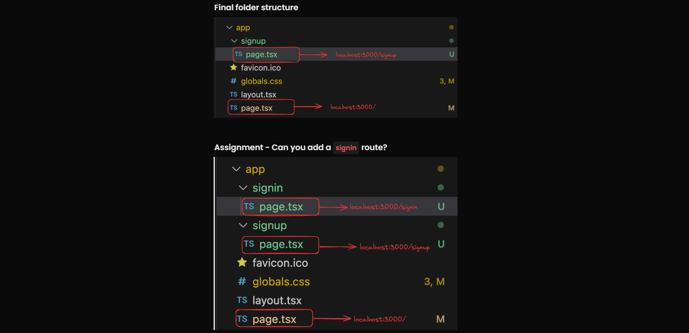

## Step 7 - Prettify the signin page

```typescript
export default function Signin() {
  return (
    <div className="h-screen flex justify-center flex-col">
      <div className="flex justify-center">
        <a
          href="#"
          className="block max-w-sm p-6 bg-white border border-gray-200 rounded-lg shadow hover:bg-gray-100 "
        >
          <div>
            <div className="px-10">
              <div className="text-3xl font-extrabold">Sign in</div>
            </div>
            <div className="pt-2">
              <LabelledInput
                label="Username"
                placeholder="harkirat@gmail.com"
              />
              <LabelledInput
                label="Password"
                type={"password"}
                placeholder="123456"
              />
              <button
                type="button"
                className="mt-8 w-full text-white bg-gray-800 focus:ring-4 focus:ring-gray-300 font-medium rounded-lg text-sm px-5 py-2.5 me-2 mb-2"
              >
                Sign in
              </button>
            </div>
          </div>
        </a>
      </div>
    </div>
  );
}

interface LabelledInputType {
  label: string;
  placeholder: string;
  type?: string;
}

function LabelledInput({ label, placeholder, type }: LabelledInputType) {
  return (
    <div>
      <label className="block mb-2 text-sm text-black font-semibold pt-4">
        {label}
      </label>
      <input
        type={type || "text"}
        id="first_name"
        className="bg-gray-50 border border-gray-300 text-gray-900 text-sm rounded-lg focus:ring-blue-500 focus:border-blue-500 block w-full p-2.5"
        placeholder={placeholder}
        required
      />
    </div>
  );
}
```

## Step 8 - Server side rendering

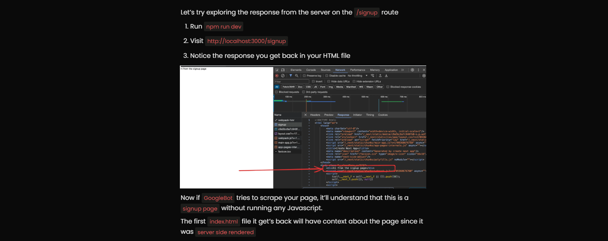

## Step 9 - Layouts


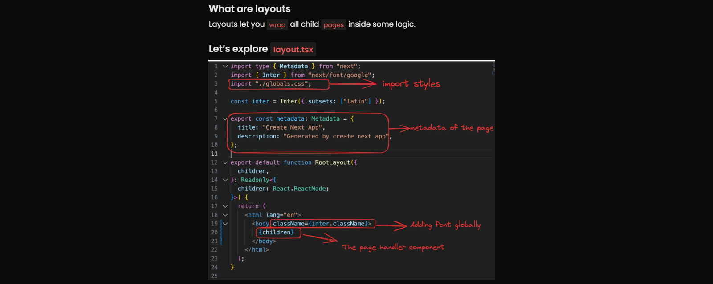
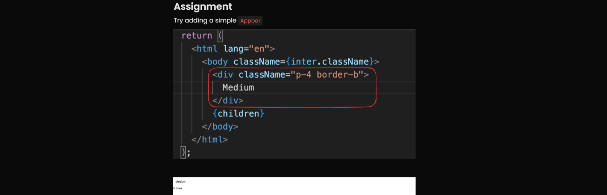

## Step 10 - Layouts in sub routes

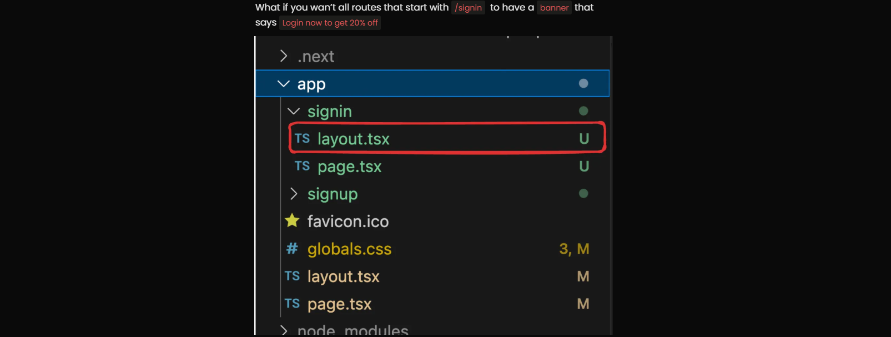

## Step 11 - Merging routes


## Step 12 - components directory
